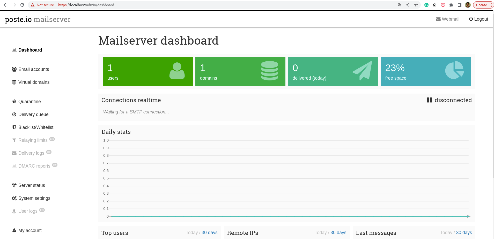

# Mail server using Podman

## Start the mailserver container

```shell
podman run -d --net=host -e TZ=Asia/Singapore -v ${PWD}/mailserver:/data:Z -it --name mailserver -h mail.example.org analogic/poste.io
```

Check container status

```shell
$  podman ps
CONTAINER ID  IMAGE                               COMMAND     CREATED        STATUS                    PORTS       NAMES
6f1aac52a922  docker.io/analogic/poste.io:latest              2 minutes ago  Up 2 minutes (unhealthy)              mailserver
```

## Access mailserver dashboard


See the container in Podman Desktop




See the container in Podman Desktop


See the container in Cockpit


```
sudo sysctl -w net.ipv4.ip_unprivileged_port_start=80
```
